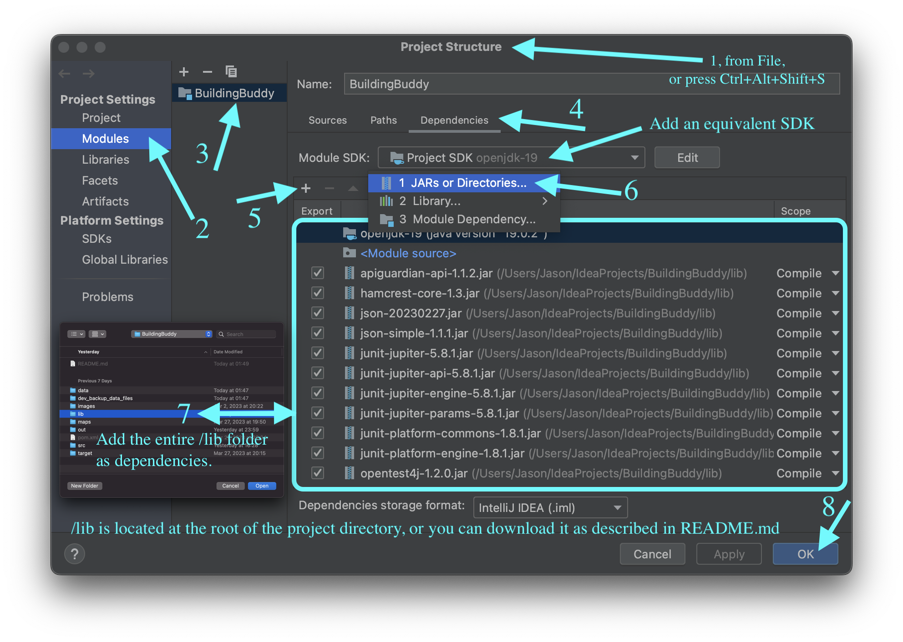

# _BuildingBuddy_ (Ver 1.0)

## Introduction
_BuildingBuddy_ is a desktop indoor navigation app designed to help students at Western University navigate through different floors in three buildings: Middlesex College, Kresge Building, and Physics & Astronomy Building. The entire development process started on January 25, 2023, and ended on April 6, 2023. Major coding work started on March 7, 2023.
## Configurations
_BuildingBuddy_ is a Maven project written in Java. The integrated development environment in use is IntelliJ IDEA, with OpenJDK 19 (Java version 19.0.2).

For better user experience, set the display resolution to 1496 * 967 or higher.

If you run from IntelliJ IDEA, create a **New Project from Version Control**. Choose **Git** as your version control, and add **URL**: https://github.com/dan1el5/BuildingBuddy.git. 

## Dependencies
All dependencies are stored locally in the `./lib` directory. Choose **File** – **Project Structure** – **Modules** – **Dependencies**, click the **+** icon, choose **JARs or Directories**, and add the entire `./lib` directory as dependencies.
If you cannot locate them, you may also download the entire `lib` directory [here](https://jasonshew.ca/_silo/lib.zip) or from [GitHub](https://github.com/dan1el5/BuildingBuddy/raw/master/dev_backup_data_files/lib.zip) as a zip file. Unzip this downloaded file and add the entire folder as dependencies to the aforesaid location. Refer to the screenshot below.

## Exploration Mode
Enter this mode by clicking the **Explore** button from the splash screen (opening screen). This interface allows the user to both view existing POIs and create new POIs, which are called My Locations in this app.

## Bookmark Manager
Enter this mode by clicking **View** – **Bookmarks** or press `CTRL + B`. This interface is designed to manage the user's favourite POIs (both built-in and user-created). Please note that the user cannot create new POIs in this mode.

## My Locations
Enter this mode by clicking **View** – **My Locations** or press `CTRL + L`. This interface is designed to manage user-created POIs. Please note that the user cannot create new POIs in this mode.

## Discovery Mode
Enter this mode by using the search bar located at the bottom left on all screens except the splash screen. The user can browse all the POIs across all the buildings or search for a specific POI. The search bar can also serve as a shortcut to any floor in any building when the search phrase is a building + floor code. Learn more in the FAQ section below.

## Development Mode
To activate Development Mode in _BuildingBuddy_, choose **More** – **Developer Tool** in the app, or press `CTRL+X`.

Development Mode is accessible only with a security key. The initial security key is `CS2212BB` (case-sensitive). Since developers are allowed to change the security key, you are encouraged to check the newest security key stored in plain text in `./data/security_key`.

This security key is designed to only prevent regular users from modifying the database accidentally.  

To quit Development Mode, either click [X] or **Exit** to quit the entire program, or click **Logout** to restart the program as a regular user.

## Special Features
* The GUI is programmed to occupy a fixed portion of screen estate regardless of screen size.
* Key features support hotkey commands for enhanced accessibility.
* Regular users can choose to delete their entire bookmark collection in one click.
* Regular users can choose to delete all locations they have defined in one click.
* Regular users can choose to reset the program to factory settings in one click.
* When a POI is added, edited, or deleted, the data lists get synced and refreshed in real time.
* Users and developers can create unlimited numbers of POIs in addition to existing built-in POIs.
* Developers can choose to erase all the built-in data in one click.
* Developers can change their security key at any time.
* The program will remember the user's last choice of building and floor before they quit or restart.
* The program will remember the user's last successful search query before they quit or restart.
* Users and developers can check if there's a new version available and update their software in one click.

## FAQ

### What is a POI?

A POI is a point of interest, namely a location on the map.

### What is a bookmark?

A bookmark is one of your favourite POIs across all the maps in BuildingBuddy.

### What is My Location?

My Location is a POI defined by the user, not a built-in POI.

### How can I bookmark / unbookmark a location?

Click on any icon that represents a POI on the map and choose <b>Add Bookmark</b> or <b>Remove Bookmark</b> before pressing <b>Save Changes</b>.

### How many My Locations are allowed to be created?

Currently, BuildingBuddy allows a user to create an unlimited number of POIs.

### How can I explore another building?

Click <b>Start</b> in the menu on top and use the building selector underneath the app logo.

### How can I get to a specific floor and see all the locations?

When you are not on the splash screen (the opening screen), you will see a search bar at the bottom left. Enter <i>building code + floor code</i> to explore any floor.

A building code is a building abbreviation:

<ul>
<li><b>MC</b> for Middlesex College</li>
<li><b>KB</b> for Kresge Building</li>
<li><b>PAB</b> for Physics & Astronomy Building</li>
</ul>

A floor code is a single-digit number + F:

<ul>
<li><b>0F</b> for ground floor</li>
<li><b>1F</b> for first floor</li>
<li><b>2F</b> for second floor</li>
<li>...</li>
</ul>

For example, if you want to visit the second floor at Middlesex College, just enter <b>MC2F</b> and click <b>Go</b> (or hit <code>Enter</code>).

The search bar remembers your last successful search phrase, so you can simply click <b>Go</b> to stay on that floor.

### How can I create a location?

As a user, you can only create a POI when you're in Exploration Mode (where you see a layer filter on the left). Click on any empty spot on the map. Edit the name and description for this location. Click <b>Save Changes</b> when you're done.

If you are managing Bookmarks, My Locations, or viewing search results, you cannot add a new POI. Those interfaces are designed to manage existing POIs.

You can add a POI by clicking <b>Start</b> in the menu and <b>Explore</b> the building where you hope to add a POI.

### Why can't I edit the room numbers for My Locations?

Room numbers are currently not available for My Locations, but you can write room numbers and any useful information in the <b>Description</b> text box. What's cool, they are searchable!

### How to view or edit bookmarks?

Enter <b>View</b> – <b>Bookmarks</b>, or press <code>CTRL + B</code>.

### How to view or edit My Locations?

Enter <b>View</b> – <b>My Locations</b>, or press <code>CTRL + L</code>.

### How many bookmarks can I have?

A user can have as many bookmarks as they want.

### Can I bookmark a "My Location"?

Sure! You can bookmark anything on any floor map.

### Can I delete My Location?

Sure! You can do that! Just bear in mind that if you delete a My Location that has been bookmarked, you lose that bookmark too.

### What are "Nuke Bookmarks", "Nuke My Locations", and "Reset BuildingBuddy"?

These three features will delete all your bookmarks, My Locations, and both. Your personalized data will be permanently erased, and the program will be restored to its default settings.

If you only choose to nuke all My Locations, they will also disappear from your Bookmarks if you have bookmarked them.

After you confirm your choice, the program will reboot automatically.

### How can I activate "Discovery Mode" to see all the POIs on all the floors in all the buildings?

Use the search bar and click <b>Go</b> right away. You can either keep the placeholder phrase <i>Search Anything...</i> in the text bar or clear it before hitting <b>Go</b>.)

### Some of my bookmarks are gone unknowingly. Why?

Sorry about that! Our developers are updating this app regularly, so some POIs may have been deleted. When they no longer exist, they disappear from your Bookmarks too.

### How to quit the application safely?

Click <b>Exit</b> from the main menu, or just hit <b>[X]</b> on top of the window.

### I am a developer. Can I add / delete POIs or browse maps the same way?

Yes, you can. Here's a few tips for developers:

<ol>
<li>Select <b>More</b> – <b>Developer Tool</b> and enter the correct security key to activate Development Mode</li>
<li>You can exit Developer Tool by hitting <b>Logout</b>; you can also click <b>Exit</b> (or <b>[X]</b>) to quit the program.</li>
<li>You can only add, edit, or remove built-in POIs. </li>
<li>You can still take advantage of the search bar to search for a specific POI and view a specific floor map (refer to the <i>MC2F</i> example above). </li>
<li>For privacy concerns, developers cannot view the user's bookmarks or any non-built-in POIs.</li>
<li>If you forget your security key, check <code>./data/security_key</code> or shoot us an email at <a href="mailto:jason@shew.cc">jason@shew.cc</a>.</li>
</ol>

### I still need help!

If you need further help or have spotted incorrect information, feel free to write us: <a href="mailto:jason@shew.cc">jason@shew.cc</a>.

## Developers

(in alphabetic order)

* Arjuna Kadirgamar
* Daniel Gomes
* Jason Shew
* Joshua Cini
* Robert Beemer
## Sources of Visuals

### Icons

* Bookmark – from icons8.com
* Classroom – by Google Classroom
* Lab – from freesvg.org
* CompSci Spot – by 3Majors
* Restaurant – from flaticon.com
* Stairwell / Elevator – from emojipedia.org
* Entrance / Exit – by freepik.com
* My Location – from pngkit.com
* Washroom – from flaticon.com
* Accessibility – from pngitem.com
* Help – from flaticon.com
* Sorry – from flaticon.com
* No Internet - from uxwing.com 
* BuddyBuilding Icon – by Jason Shew

### Background Images

* Middlesex College – from Media Relations at UWO 
* Kresge Building – by Flickr user tpirie
* Physics & Astronomy Building – from Wikipedia

